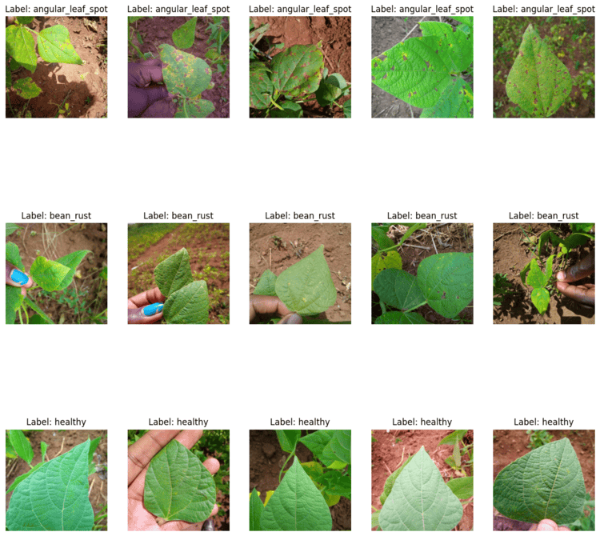
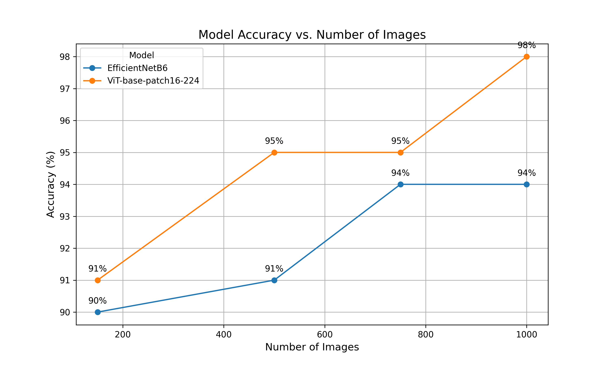

# beans-dataset-classification
beans dataset classification

In this project, I am running two transfer learning models to classify images.  
The models I used are EfficientNetB6 and ViT.
## The dataset
  
The beans dataset consists of leaf images taken in the field from different districts in Uganda by the Makerere AI lab.  
It is a well-known dataset for learning machine learning.  

The goal is to build a robust machine learning models that is able to distinguish between diseases in the Bean plants  

[Link to Dataset beans](https://github.com/AI-Lab-Makerere/ibean)

## The models
[EfficientNetB6](https://www.tensorflow.org/api_docs/python/tf/keras/applications/EfficientNetB6)   

[ViT-base-patch16-224](https://huggingface.co/google/vit-base-patch16-224)

## The process

I run the models with different parameters and selected the best results.  
In order to examine the models more thoroughly and compare them, i took the dataset and divided it into smaller random subsets.  

I used subsets of 150 images, 500 images, 750 images, and the entire dataset (approximately 1,000 images).
(The script for splitting the mock dataset into random image subsets is included in the scripts folder.)

Afterward, I run both models on each subset of images.

Note: The test and validation images remained unchanged across all subsets.

 ## The result

| Model                        | Accuracy | Precision | Recall | F1 Score | Running Time |
|------------------------------|----------|-----------|--------|----------|--------------|
| EfficientNetB6 (150)          | 0.81     | 86%       | 81%    | 81%      | 36m          |
| EfficientNetB6 (500)         | 0.89     | 90%       | 89%    | 89%      | 81m          |
| EfficientNetB6 (750)         | 0.95     | 95%       | 95%    | 95%      | 119m         |
| EfficientNetB6 (1000)        | 0.94     | 94%       | 94%    | 94%      | 165m         |
| ViT (google/vit-base)150     | 0.84     | 84%       | 84%    | 84%      | 4m           |
| ViT (google/vit-base)500     | 0.93     | 94%       | 93%    | 93%      | 10m          |
| ViT (google/vit-base)750     | 0.96     | 96%       | 96%    | 96%      | 15m          |
| ViT (google/vit-base)1000    | 0.96     | 96%       | 96%    | 96%      | 21m          |

## conclusions 
It can be observed that the results improve as the number of images increases.  

Additionally, the ViT-base-patch16-224 model demonstrates better performance overall.  
An important point is that the transformer model requires significantly fewer resources,  
which allows for more iterations and model improvement.  
  
In the transfer model, I didn’t add augmentation to the images because it reduced the performance of the results.  
Since the images were taken in field conditions with different backgrounds and from various angles, I believe it’s not necessary.  

However, for future use of the model, it’s recommended to ensure that overfitting doesn’t occur.